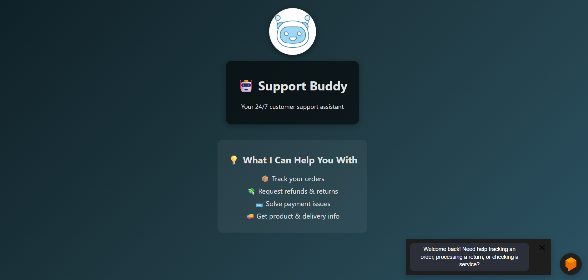
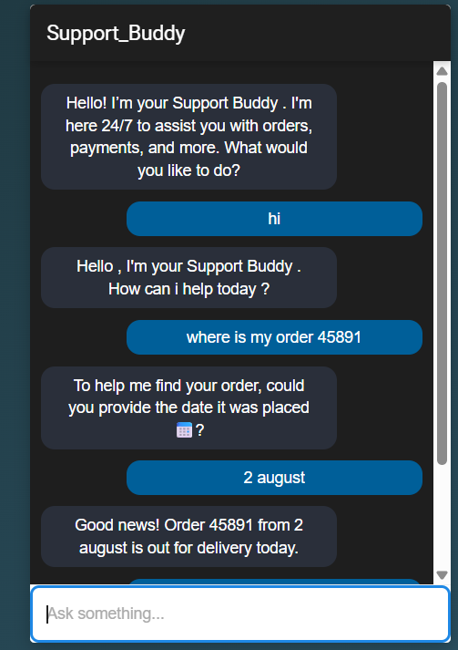
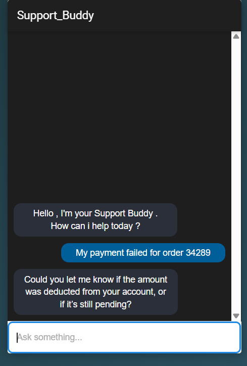
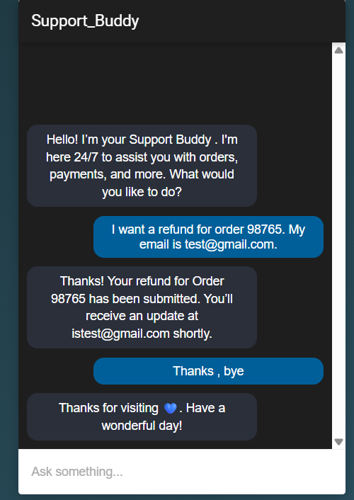

# 🤖 Support Buddy – Customer Support Chatbot

Support Buddy is a Dialogflow-powered chatbot built as part of my **Machine Learning Internship**.  
This project focuses on providing an interactive customer support assistant that can handle order tracking, payment issues, refunds, and general queries in a human-like manner.

---

## 🎯 Internship Task
This chatbot was developed as **Task 3 of my ML Internship**.  
The goal was to integrate a Dialogflow agent with a web interface and create a customer support bot capable of managing common e-commerce queries.

---

## 🚀 Features
- 📦 **Order Tracking** – Track order status using Order ID & date.  
- 💳 **Payment Support** – Assist with failed or pending payments.  
- 🚚 **Shipping Info** – Share delivery timelines and free shipping eligibility.  
- 🔄 **Returns & Refunds** – Guide users through refund and return requests.  
- ⭐ **Premium Plan** – Explain benefits of premium membership.  

---

## 🛠️ Tools & Technologies Used
- **Dialogflow ES** – For natural language understanding  
- **Dialogflow Messenger** – For chatbot web integration  
- **HTML, CSS** – To build and style the UI  
- **GitHub** – For version control and project sharing  
- **VS Code** – Development environment  

---

## 📚 Key Learnings
- Designing intents and entities to handle varied user queries  
- Managing **required parameters** (Order ID, Date, Email) for accurate responses  
- Handling fallback and clarification prompts to make the bot more human-like  
- Integrating Dialogflow Messenger snippet into a live HTML page  
- Organizing and documenting projects professionally on GitHub  

---

## 📂 Project Structure
support-buddy/
│
├── index.html # Main integration file
├──  logo.png # Project logo
├── screenshots/
│ ├── full_ui.png
│ ├── order-tracking.png
│ ├── payment.png
│ └── refund.png
└── README.md

---

## 📸 Screenshots

### Full Chatbot UI

### Example – Order Tracking

### Example – Payment Support

### Example – Refund Request

---

## 🌍 Live Demo
🔗 **Public Link**: [View Chatbot UI](https://support-buddy.netlify.app/)  

---

## 👩‍💻 Author
**Aashima Bhatia**  
📧 Email: aashimabhatia2005@gmail.com  
🔗 [LinkedIn](https://www.linkedin.com/in/aashima-bhatia-a30919300/)  

---

## 🔮 Future Improvements
- 🧾 **Multilingual Support** – Add Hindi and other regional languages.  
- 📊 **Analytics Dashboard** – Track user queries and improve responses.  
- 🔔 **Proactive Notifications** – Notify users about shipping delays or offers.  
- 🤝 **Integration with CRM** – Directly log tickets into a support system.  
- 🎙️ **Voice Support** – Enable voice input for hands-free experience.  
- 📱 **Mobile App Integration** – Embed chatbot in an Android/iOS app.  

---

## 🙌 Acknowledgements
- Internship mentor(s) for guidance  
- Google Dialogflow for providing the NLU platform  

---
